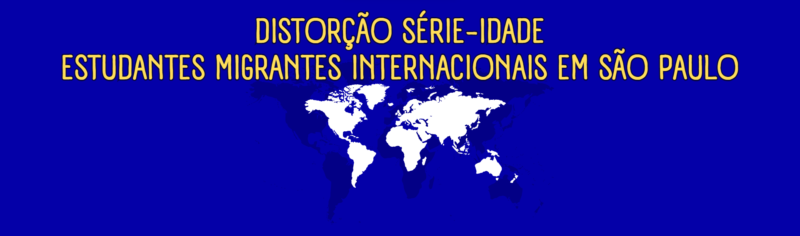
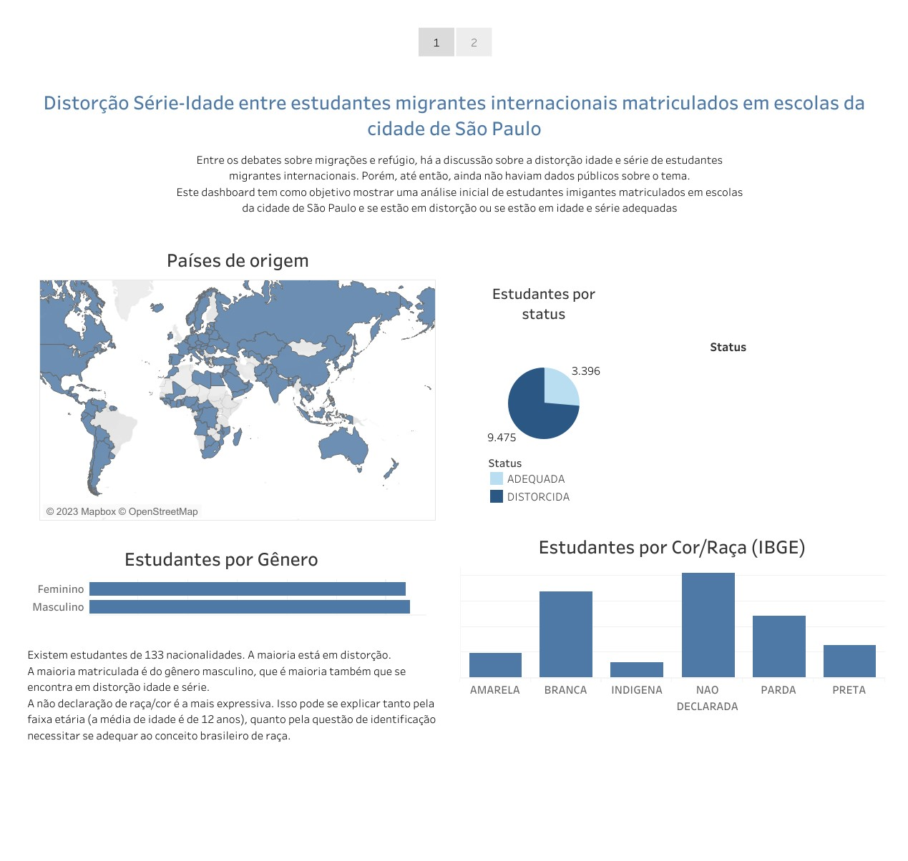
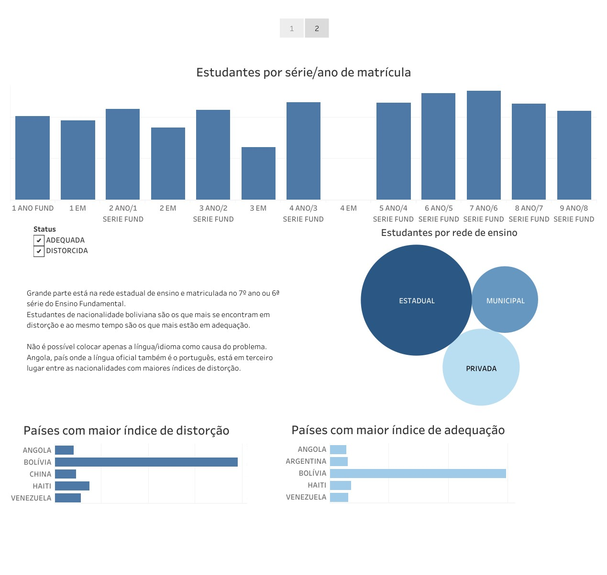
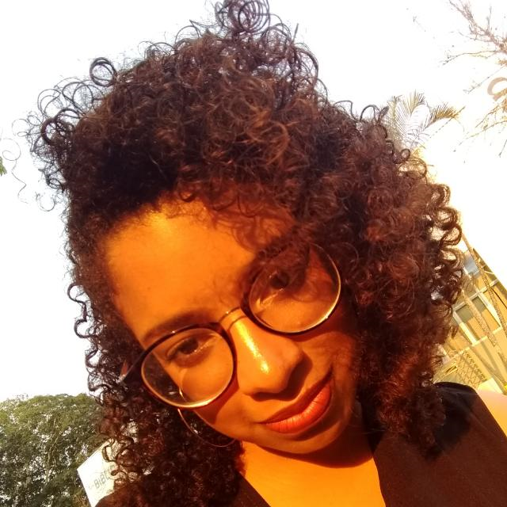

 

# 
<b> A distorção série-idade entre estudantes imigrantes em escolas da cidade de São Paulo

## 
<b> Este é projeto final do curso de Python e Análise de Dados da {Reprograma} | Turma On26

## Contexto 
Como pesquisadora em migrações, venho percebido discussões acerca de um dos problemas nos quais faz com que estudantes migrantes não permaneçam no ensino regular: a distorção série-idade. Quando a pessoa estudante não consegue desenvolver os estudos por estar em um ambiente muito diferente de seu perfil, estar em outra cultura, além das questões de idioma, nível de conhecimento do conteúdo, entre outros... Considerando os poucos dados disponíveis com esse foco, espero que esse projeto ajude outras pessoas com interesse no tema e sirva para gerar um estudo sobre essa problemática.

O projeto consiste na análise exploratória de uma base de dados disponibilizada pelo Portal de Imigração. A base contém país de origem, série de matrícula, a idade, gênero, raça, região da escola, região de residência no Brasil, entre outros. O objetivo desse projeto é que seja possível obter uma análise quantitativa acerca de estudantes migrantes no Brasil que estão ou não em distorção.
O Tableau foi utilizado para gerar a visualização das análises.

### ODS
O tema do presente projeto promove o debate da educação de qualidade para estudantes imigrantes e, consequentemente, gera a redução de desigualdades. A educação é a porta de entrada para o mercado de trabalho digno no Brasil. Alinhando-se com os objetivos 4 e 10 dos Objetivos para o Desenvolvimento Sustentável da ONU.

 

## Objetivos gerais e específicos do projeto 
O objetivo geral é verificar quantos estudantes imigrantes internacionais do ensino regular no Brasil estão em distorção idade-série

Os objetivos específicos são:
- Analisar se questões de raça, gênero, nacionalidade são relevantes
- Trazer reflexões de quais medidas podem ser tomadas para a resolução desse problema

### Base escolhida

- Estudantes imigrantes internacionais matriculados em escolas no Brasil, disponibilizado pelo Portal de Imigração e pelo INEP. Acesse em: [Base Inicial](https://portaldeimigracao.mj.gov.br/pt/microdados/2-sem-categoria/401387-inep)
- Dicionário do dataset disponibilizado pelo Portal de Imigração. Acesse em: [Dicionário](https://portaldeimigracao.mj.gov.br/pt/microdados/2-sem-categoria/401387-inep)
- Relatório da UNICEF sobre distorção idade e série para consulta de tabela com a idade adequada para cada ano ou serie escolar. Acesse em: [Panorama distorção idade serie no Brasil - UNICEF](https://www.unicef.org/brazil/media/461/file/Panorama_da_distorcao_idade-serie_no_Brasil.pdf)

## Ferramentas utilizadas
Os dados da base inicial foram tratados com as bibliotecas Pandas e Numpy (pode ser observado no arquivo tratamento.ipynb) até resultar na base final do projeto: saopaulo.csv
No arquivo projeto_final.ipynb, além de Pandas e Numpy, foram utilizadas as bibliotecas Matplotlib e Seaborn para gerar algumas visualizações para auxiliar a análise dos dados.

## Visualizações

 

 

Para acessar nossa visualização dos dados via Tableau, [clique aqui](https://public.tableau.com/views/DISTORAOSERIEIDADEESTUDANTESIMIGRANTESEMSAOPAULO/Histria1?:language=pt-BR&:display_count=n&:origin=viz_share_link).

Para acessar a apresentação para essa análise, [clique aqui](https://www.canva.com/design/DAF2YgLdbxY/djokIom7nDIc1SGQpid9VQ/edit?utm_content=DAF2YgLdbxY&utm_campaign=designshare&utm_medium=link2&utm_source=sharebutton).
### Agradecimentos
Cheguei até essa etapa do curso com o apoio da minha família, da On26, de professoras maravilhosas que se dedicaram a nos ensinar em meio a tantos desafios e da equipe Reprograma que se dedicou dias e noites para que tudo fosse possível

## 👩🏾‍💻 Autora
 

<a>
 
  
</a>

 Desenvolvido por  
